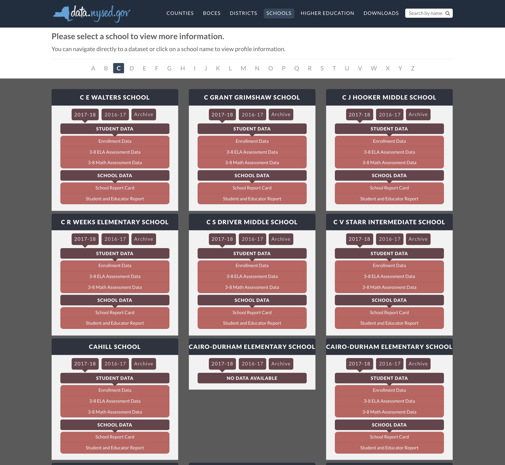

# NY State Education Data - React Props



## The Goal
In this lab, you will recreate a page from the New York State School Education Data (NYSED) website. You will be using real New York State education data to complete this lab. The page we are replicating contains an extensive amount of content (click the link below to view), and by using props we be able to quickly and easily emulate this site.


Take a look at the page you'll be designing:
[C-Schools | NYSED Data Site](https://data.nysed.gov/lists.php?start=67&type=school)

The full NYSED data site can be found below:
[NYSED Data Site](https://data.nysed.gov/)

#### Some Context
New York collects vast amounts of data about every school in the state. They collect enrollment data about student demographics, graduation rates, state test results, and school survey data. All of this data is aggregated and presented in a user friendly way at the NYSED website.

For this lab, we are going to replicate a page of the NYSED website. Users are able to look up school by letter. We are going to try and reproduce the webpage for all the schools in New York State that start with the letter "C."

## Getting Started

1. Clone this repository using `git clone`
2. `cd` into the `react-NYSED-lab` folder
3. Open the file `nycSchoolEnrollmentData.js` in the `src` directory. This contains demographic data for every school in New York state that begins with the letter "C." Take a look a see how this data is structured.
4. Now, open `App.js` and notice how the school data has been imported as "data" already. You're ready to get started.
5. `npm install`
6. `npm start`

## The Lab
1. Add a `SchoolCard` component to inside the `row` element. Make sure that it renders. 
```react
<SchoolCard />
```
2. Create additional instances of the `SchoolCard` component inside the `row` element. Make sure that they all render.
```react
<SchoolCard />
<SchoolCard />
<SchoolCard />
```
3. Pass a name as a string to that first school card. Modify the card to take props when it is initialized. Have the school name render out on the card using JSX. 
```react
<SchoolCard name="Your High School"/>
```
4. Pass names to all three `SchoolCard` components we've created so far.
```react
<SchoolCard name="Your High School"/>
<SchoolCard name="Neptune High School"/>
<SchoolCard name="East High School"/>
```
5. Pass names to all three `SchoolCard` from the `data` instead of hardcoding those pieces of information.
```react
<SchoolCard name={data[0].ENTITY_NAME}/>
<SchoolCard name={data[1].ENTITY_NAME}/>
<SchoolCard name={data[2].ENTITY_NAME}/>
```
6. Change the card from taking in a hardcoded string, and have it take in the school's entire data object instead. The SchoolCard component will need to be refactored based on this information, as we're now passing a school object instead of a name string. 
```react
<SchoolCard school={data[0]} />
<SchoolCard school={data[1]} />
<SchoolCard school={data[2]} />
```
Be sure to change the component to display the `ENTITY_NAME` property of the object.

7. Change the SchoolCard to display at least three interesting pieces of demographic data about the school. 

8. Expand your app by displaying data from the first six schools (instead of just one).

9. Add additional demographic data.

## Extensions
1. Using a JavaScript `.map()` method, iterate through the school data so that EVERY school appears on the webpage.

2. Some schools don't have any data available (these schools are usually too new to have any data collected yet). On the NYSED website, schools without any data are labeled with "No Data Available" instead of the usual card. Update the SchoolCard component so schools with no data appear with the appropriate label.

Reference: https://reactjs.org/docs/conditional-rendering.html
