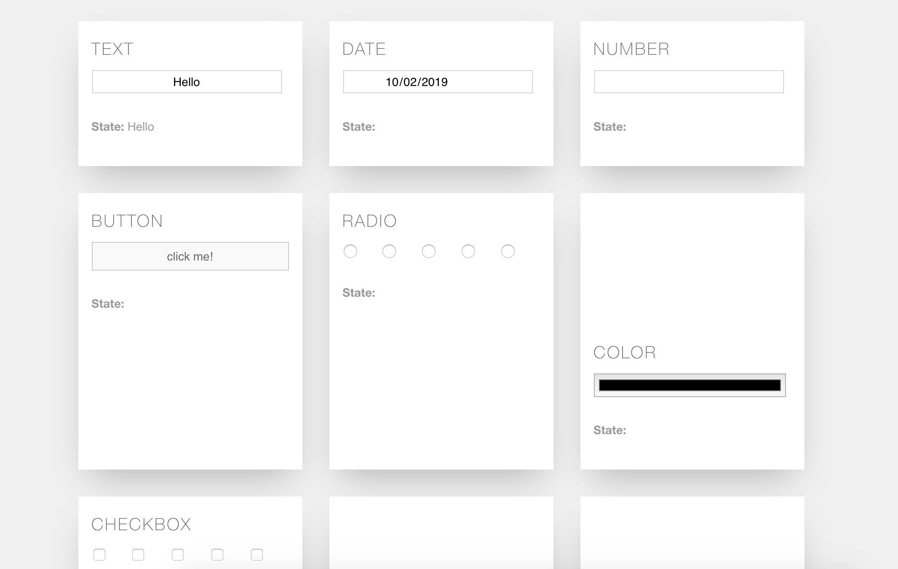

# React Fidget App Lab (React State Lab)

## The Goal

In this lab, you'll create a digital fidget toy - it will use functional components that store state. In the same way that real fidget spinners and fidget cubes have moveable parts that don't do much, this app won't do anything other than give some fun visual responses when the user clicks buttons, types words, and selects colors.

Check out the [finished app](https://fidget-tiles-solution.netlify.app/) to see what you'll be building.

## Getting Started

1. Clone this repository using `git clone`
2. `cd` into the lab
3. `npm install`
4. `npm start`

## The Lab

Overall, we will be converting the code in `App.js` into functional components that store state.

0. Inspect the code in `App.js` and `Components/TextInput.js`. Notice that the `<TextInput />` component has already been completed in `App.js` and will be a pattern to follow for other functional components with state.

1. Go to the second component, called `<DateInput />`, that displays the date `input` selection in the `span` with the name `dateOutput`. You will need to:
	1. add an inline event to listen for when a change is made to the date `input`. This will need to use the `setState` method.
	2. create a `this.state` object, and a property in that state object to store the value of the date.
	3. display the value of the state in the span.

2. Open the component called `<NumberInput />` that displays the number `input` selection in the `span` with the name `numberOutput`.

3. Create a new component called `<ButtonInput />` that switches state between `true` and `false` when the button is pressed. Display the state in the `span` with the name `buttonOutput`.

> Consider using a ternary operator (or an `if` statement) to display the value of the state. You will not be able to display the state directly.
> Don't forget to import the component into `App.js`

4. Create a new component called `<RadioInput />` that displays which radio button is selected in the `span` with the name `radioOutput`.

> Don't forget to make the function name match the component name, and to export the function from the component file.

5. Create a new component called `<ColorInput />` that displays the selected color in the `span` with the name `colorOutput`. Then create and use an inline style to format the `BackgroundColor` of the `div` with the class `card-image` with the color selected by the input.

## Extensions

6. Create a new component called `<CheckboxInput />` that displays how many checkboxes are checked in the `span` with the name `checkboxOutput`.

7. Create a new component called `<RangeInput />` that displays the value of the input in the `span` with the name `rangeOutput`. Then style the `div` with the class `card-image` as black (0), white (100), or gradations of gray (between 0 and 100).

> Recall that color can be formatted using `rgb()` notation which takes three values between 0 and 255: `rgb(0, 0, 0)` is black, `rgb(255, 255, 255)` is white, and grays are in between with the same value for the three parameters, e.g. `rgb(120, 120, 120)` is medium-dark gray.

8. Create a new component called `<SelectInput />` that displays the value of the selection in the `span` with the name `selectOutput`. Then style the `BackgroundImage` of the `div` with the class `card-image` with a picture of the animal that was selected.

9. Create a new component called `<UrlInput />` that displays the value of the input in the `span` with the name `urlOutput`. Ensure that the URL in the output is clickable and sends a user to a new website.

10. Build a passcode lock component that only unlocks (or displays a "Success!" message to a user) when they input the correct value in each of four numerical `input` fields. For example, if the secret passcode is `1783`, the first box must contain a `1`, the second a `7`, the third an `8`, and the fourth a `3`, otherwise the user gets a "Failure to unlock" message.
