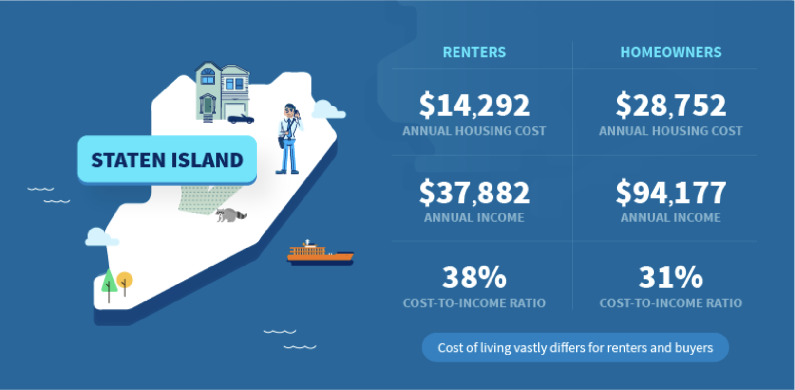

# Reusable Components with Props - Lab



## The Goal
StreetEasy is a site used to buy, sell, and rent apartments in New York City. StreetEasy also leverages both public and in house data to publish a blog about real estate trends in the city.

The problem is, they could be creating their blog posts much more efficiently. Instead of designing individual graphics as they do now (see example above), they could be using reusable components in React to quickly create, update and display data on their site. In this lab we are going to refactor a page from their blog using React - they'll thank us for this later.

## Getting Started

1. Clone this repository using `git clone`
2. `cd` into the `street-difficult-reusable-components-props-lab` folder
3. `npm install`
4. `npm start`

After it has installed, go to the link below to check out the blog post we will be refactoring:
[Cost of Living in NYC](https://streeteasy.com/blog/cost-of-living-nyc-income-housing-all-5-boroughs/)


## The Lab
1. We are going to be begin by making the Staten Island graphic from the StreetEasy blog post. In the `App.js` component, find the `<DataView/>` component below the `<Navbar/>` component. Add the following attributes to the `<DataView/>` component. This will pass down the provided information as props to the component.

```javascript
<DataView
  borough="Staten Island"
  renterCost="$14,292"
  ownerCost="$29,752"/>
```

2. Uh oh! You'll notice the ownerCost prop isn't being displayed! Update the `DataView.js` file to render the ownerCost prop.

3. Add an additional `<DataView/>` component to the `App.js` for each of the boroughs (Queens, Brooklyn, Manhattan, Bronx). Fill in the props with the data provided in the StreetEasy blog post.

4. Open the `<DataView/>` component. We are going to add another row so we can display the annual income in this component. To do so, add the code below beneath the renter cost (in the example, it is below line 18).

```javascript
<div className="text bottom">
  <h2 className="text-data">{props.renterIncome}</h2>
  <h3 className="text-label">Annual Income</h3>
</div>
```

Then add this code to the bottom of the right column (in the sample, it is after line 34). 

```javascript
<div className="text bottom">
  <h2 className="text-data">{props.ownerIncome}</h2>
  <h3 className="text-label">Annual Income</h3>
</div>
```

To add the borders between the rows, delete the `bottom` class from the two divs that are no longer the bottom of their respective columns (now their className will just be `"text"`. Then, pass the annual income data as props to the `<DataView/>` component.

```javascript
<DataView
  borough="Staten Island"
  renterCost="$14,292"
  ownerCost="$29,752"
  renterIncome="$37,882"
  ownerIncome="$94,177"/>
```

5. Add the `renterIncome` prop and `ownerIncome` prop to each `<DataView/>` component with the appropriate data.

## Extensions

1. Add another row to the `<DataView/>` component to display the "Cost-To-Income ratio" for each borough.

2. You'll notice there is a message at the bottom of each graphic. For example, in the Staten Island graphic it says "Cost of living vastly differs for renters and buyers." Add this piece of styling and text to the DataView component.
