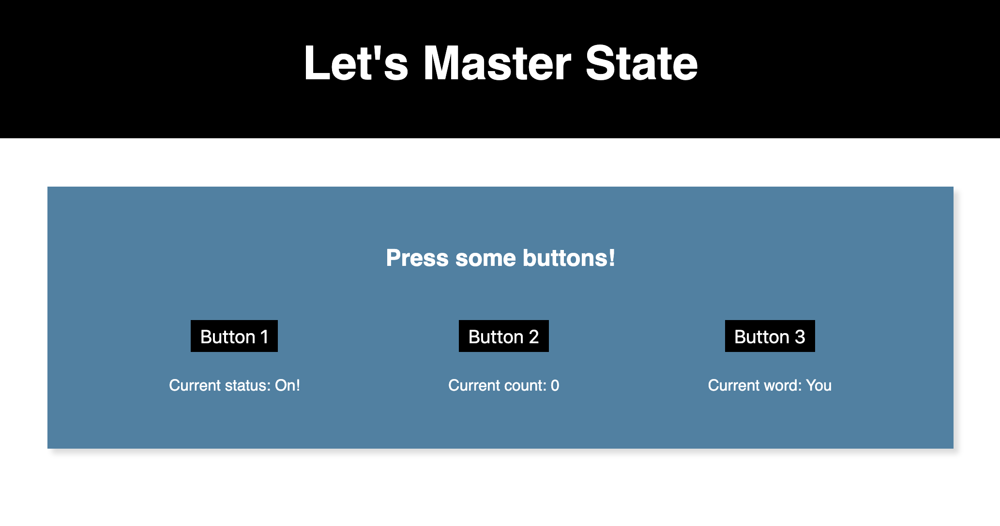

# Three Button State Lab

This lab is meant to accompany the [State lecture guide](https://github.com/upperlinecode/CS-and-the-City-Curriculum/blob/master/react/state-inline-events.md) which is part of the CS + The City curriculum created by Upperline Code in partnership with the NYC Department of Education. 

## Getting Started

1. Clone this repository using `git clone`
2. `cd` into the project folder
3. `npm install`
4. `npm start`
