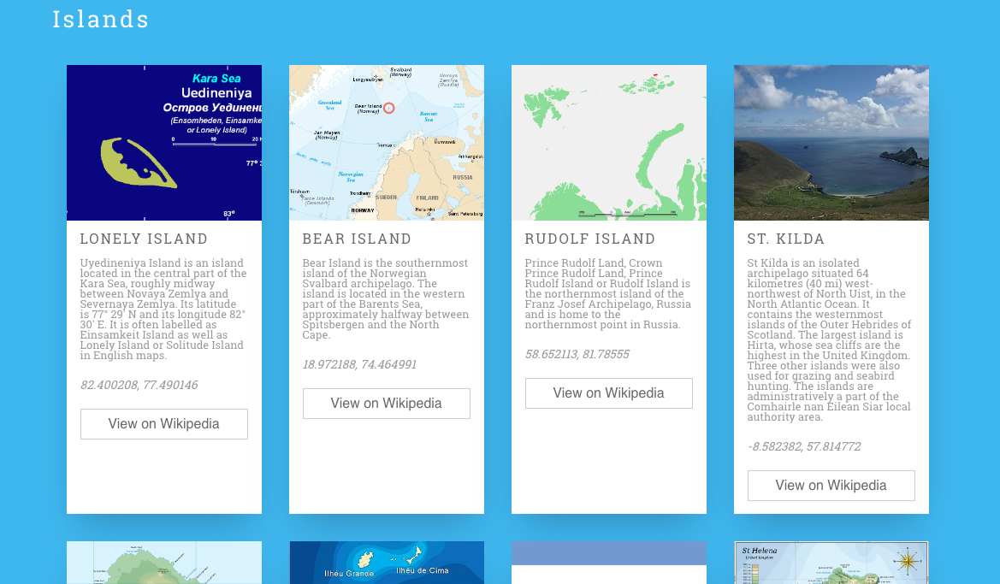
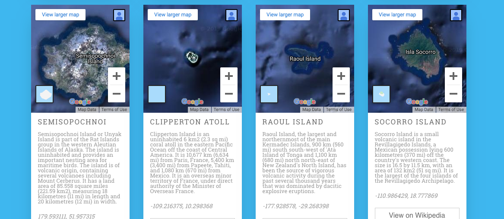

# Atlas of Remote Islands: A React Lab

## The Goal

This lab is based on the book _[Atlas of Remote Islands: Fifty Islands I Have Never Set Foot On and Never Will](https://www.amazon.com/Atlas-Remote-Islands-Fifty-Never/dp/014311820X)_ by Judith Schalansky. The book describes 50 remote islands from around the world; data about those islands has been collected into the `src/atlas-of-remote-islands.js` file. Your goal is to represent the islands as options on a travel-like site.

> NOTE: A geographic map and a `.map()` method are two different things, and the meanings can get a little muddled if you aren't careful. The reason the `.map()` method is named how it is - each item in the new array corresponds to (maps to) an item in the original array. For our purposes, we're going to be careful to use the phrase `.map()` when we mean the method, and Map when we mean the geographic representation.

## Getting Started

1. Clone this repository using `git clone`
2. `cd` into the project folder
3. `npm install`
4. `npm start`

## The Lab

1. Note that `App.js` is importing the `data` from `atlas-of-remote-islands.js`, and there is a `console.log(data)` as part of `App.js`. Open the Developer Tools in your browser and explore the `data` object.

2. One card has already been componentized for you. Use `.map()` to update `App.js` so that it generates a card for each entry in `data.islands`.

> It's ok if the cards don't yet have any data in them, but there should be a total of 50 cards.

3. Update your `.map()` function to pass data about each island to each card as props. You can `console.log(props)` in `Card.js` to check that props are being passed.

4. From `Card.js`, pass props to the `<CardInfo />` component for the island name, description, latitude, longitude, and Wikipedia link.

5. Display the island name, description, latitude, and longitude in the card. Then pass the Wikipedia link as a prop to the `<WikiButton />` component, and set the `href` for the `<a>` tag around the button. Clicking on each button should open that island's Wikipedia page in a new tab.

6. Pass the `image` URL to `<CardImage />` component, and check that `CardImage.js` is receiving it.

7. Use inline styling to set the `backgroundImage` of the `
` with `className=card-image` as the `image` passed to `<CardImage />` via props.

## Extensions

8. Add a new component to each card that renders a Google Map of each island (see above). There are several ways to do this!

> Hint: you can use the latitude and longitude along with Google Maps' `<embed>` code; also, set the width of the embed to `100%` to fill the container.

> Depending on how you've accomplished this, consider commenting out this component while you work on the remaining tasks so you're not re-rendering the maps each time.

9. Update the interface to group cards by their `region`: Arctic Ocean, Atlantic Ocean, Indian Ocean, Pacific Ocean, Antarctic Ocean. How might you pre-process the `data` in order to get a list of all unique regions?

> Hint: consider how you might use the `.filter()` method to populate cards in each section.

10. Add an option that sorts islands (a) alphabetically by name (A to Z), or (b) by page number (lowest to highest). Store the choice in state and apply the sort to each region.
